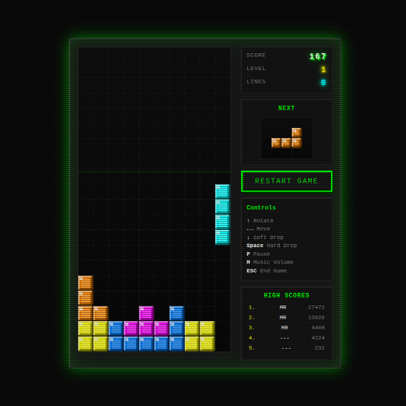

# 8-Bit Tetris

A retro-styled, browser-based Tetris game with authentic 8-bit visuals, sound effects, and a CRT monitor aesthetic.

## Features

*   **Authentic 8-Bit Style:** Pixel-perfect graphics with dithered blocks, grid lines, and a dark, moody color palette reminiscent of classic arcade games.
*   **Retro Visual Effects:**
    *   CRT Scanline Effect: Animated scanline moves down the screen.
    *   Pixel Explosions: Blocks disintegrate with animated pixel particles when lines are cleared.
    *   Block Flashing: Cleared lines flash brightly.
    *   Screen Shake: For clearing multiple lines at once.
    *   Glowing UI: CRT-like glow around the game container and animated score.
    *   Phosphor Glow: Subtle inner glow on the game canvas.
*   **Sound & Music:**
    *   8-Bit Sound Effects: Distinct sounds for rotation, dropping, and line clears using the Web Audio API.
    *   Embedded MIDI Music: Plays a classic Tetris theme (Grand Piano instrument) using a base64 encoded MIDI file and the Web Audio API. Volume can be cycled (M key).
*   **Gameplay:**
    *   Classic Tetris mechanics with scoring, levels, and increasing speed.
    *   Next piece preview.
    *   Smooth controls (Arrow keys for movement, Space for hard drop, P for pause).
    *   High Score tracking using localStorage.
    *   Name entry for high scores (3 letters).
*   **Responsive Design:** Centered layout that fits well on various screen sizes.

## Controls

*   **← / → :** Move piece left/right
*   **↑ :** Rotate piece
*   **↓ :** Soft drop (move down faster)
*   **Space :** Hard drop (instantly drop piece)
*   **P :** Pause/Resume game
*   **M :** Cycle music volume (100% -> 50% -> 25% -> Muted -> repeat)
*   **ESC :** End current game (resign)

## Screenshots

## How to Play

1.  Open the `index.html` file in a modern web browser.
2.  Click the "Start Game" button.
3.  Use the keyboard controls to move and rotate the falling tetrominoes.
4.  Complete horizontal lines to clear them and earn points. Clearing multiple lines at once yields higher scores and triggers more intense visual effects.
5.  The game speeds up as you level up by clearing lines.
6.  If a new score makes it onto the high score list, enter your 3-letter initials.

## Technical Notes

*   The game is implemented using HTML5 Canvas for rendering the game board and pieces.
*   The visual effects are created using DOM manipulation and CSS animations for particles and overlays.
*   The MIDI music player is implemented using the Web Audio API and a base64 encoded MIDI file.
*   Sound effects are generated using the Web Audio API's OscillatorNode.
*   High scores are persisted using the browser's localStorage API.
*   The game loop uses `requestAnimationFrame` for smooth rendering.
